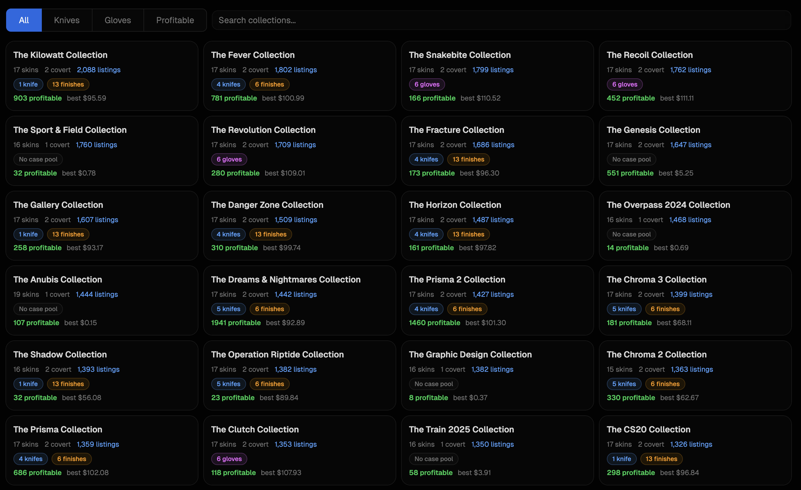

# CS2 Trade-Up Bot

Real-time CS2 trade-up contract analyzer. Finds profitable trade-ups across all rarity tiers using market data from CSFloat, DMarket, and Skinport.

**Live at [tradeupbot.app](https://tradeupbot.app)**

## Features

**Trade-Up Discovery** — Evaluates thousands of listing combinations every 12 minutes across all rarity tiers (Knife/Glove, Covert, Classified, Restricted, Mil-Spec). Float-targeted selection at 45+ transition points per collection.

**Price Intelligence** — Float vs price scatter charts with data from CSFloat, DMarket, Skinport, and sale history. Per-condition pricing across every source.

**89 Collections** — Browse every collection with knife/glove pool info, listing counts, and profitable trade-ups.

## How It Works

CS2 trade-up contracts let you trade 10 skins of one rarity for 1 skin of the next rarity. The output float is deterministic: `outFloat = outMin + avg(normalized_inputs) * (outMax - outMin)`. The only randomness is *which* output skin you receive (probability-weighted by collection representation).

The bot continuously fetches real market listings, tests thousands of input combinations at specific float targets, and identifies trade-ups where the expected value exceeds the input cost.

## Stack

- **Frontend**: React, Vite, Tailwind CSS, shadcn/ui
- **Backend**: Express, SQLite (WAL mode), better-sqlite3
- **Data**: CSFloat API, DMarket API, Skinport WebSocket
- **Auth**: Steam OpenID (passport-steam)
- **Payments**: Stripe (checkout, portal, webhooks)
- **Infra**: Hetzner VPS, nginx, PM2, Let's Encrypt
