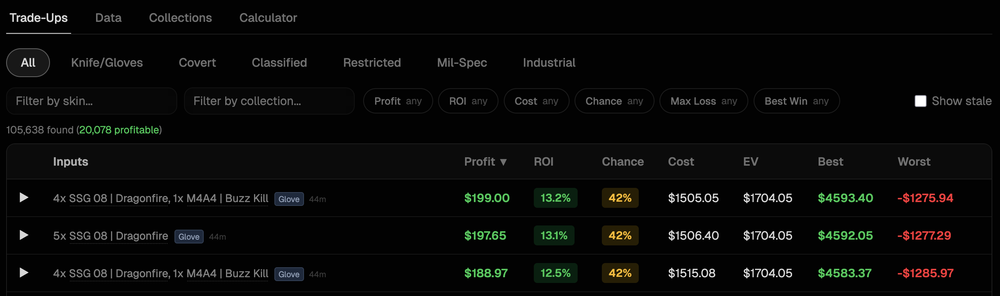
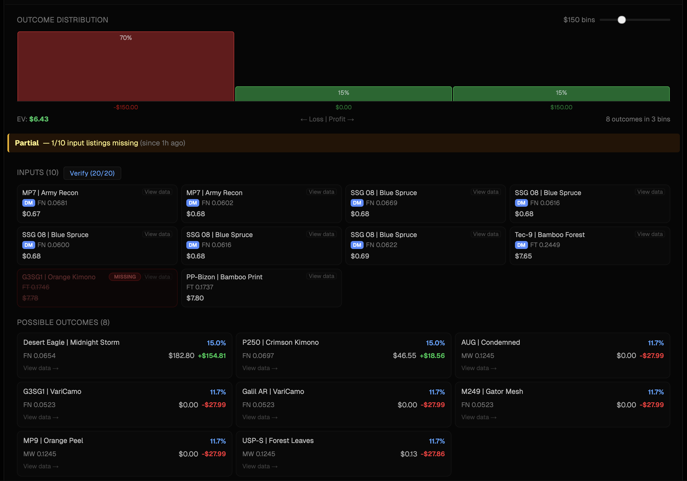
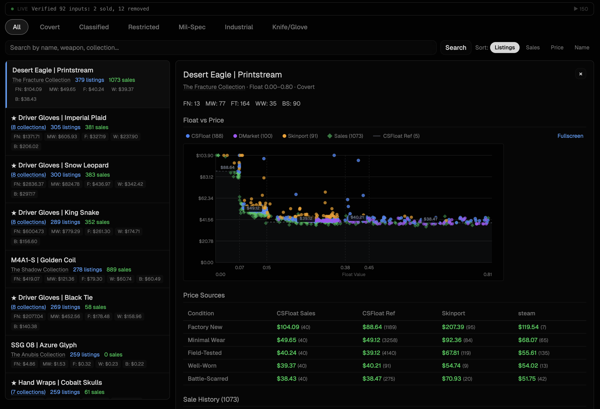
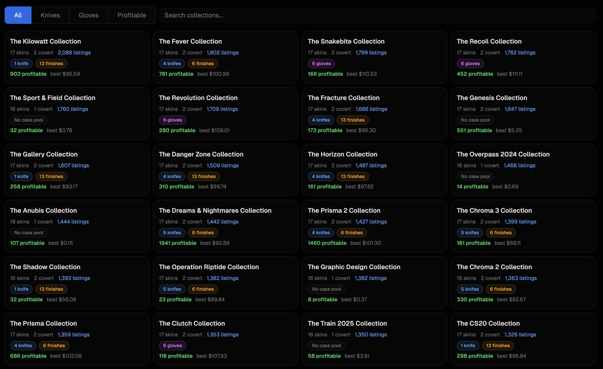

# CS2 Trade-Up Bot

Real-time CS2 trade-up contract analyzer. Continuously discovers profitable trade-ups across all 6 rarity tiers by combining live market data from CSFloat, DMarket, and Skinport with a time-bounded discovery engine that evaluates thousands of listing combinations per cycle.

**Live at [tradeupbot.app](https://tradeupbot.app)**



## How Trade-Up Contracts Work

CS2 trade-up contracts let you trade 10 skins of one rarity for 1 skin of the next rarity tier. The output float (condition value) is deterministic:

```
outputFloat = outputMin + avg(normalizedInputFloats) * (outputMax - outputMin)
```

The only randomness is *which* output skin you get, weighted by how many collections are represented in the inputs. This means profitability is calculable — if you know the input prices, output prices at the resulting float, and the probability distribution across possible outputs, you can compute exact expected value.

The bot automates this: it fetches real market listings, tests input combinations at specific float targets near condition boundaries (where price jumps are largest), and identifies trade-ups where EV exceeds cost.

## Features

**Discovery Engine** — Evaluates thousands of listing combinations every 20-minute cycle across all rarity tiers (Consumer through Knife/Glove). Float-targeted selection at 45+ condition-boundary transition points per collection. Workers run in parallel child processes with time-bounded budgets.

**Outcome Probability Charts** — Each trade-up expands to show every possible output skin with its probability, market price at the predicted float, and profit/loss. Visual breakdown of exactly where your money goes.



**Price Intelligence** — Float vs. price scatter charts with data from CSFloat sales, DMarket listings, and Skinport. Per-condition pricing across every source. Custom canvas-based scatter chart implementation for rendering 10K+ data points.



**Collection Browser** — All 89 collections with knife/glove pool info, listing counts, and profitable trade-up counts.



**Claim & Verify System** — Pro users can claim trade-ups (locks the underlying listings for 30 minutes) and verify that input listings are still available on-market before purchasing. Verification propagates status changes across all trade-ups sharing those listings.

**Tiered Access** — Free/Basic/Pro tiers with Stripe billing. Free tier shows top 10 per type with a 30-minute delay. Pro gets real-time data, claims, and higher verify limits.

## Architecture

~20K lines of TypeScript across 56 server files and 38 frontend files.

```
┌─────────────────────────────────────────────────────────────┐
│  React Frontend (Vite, port 5173)                           │
│  Trade-up table, data viewer, collection browser            │
├─────────────────────────────────────────────────────────────┤
│  Express API (port 3001, proxied by Vite)                   │
│  Trade-up list, verify, claims, Stripe webhooks, Steam auth │
├──────────┬──────────────────────────┬───────────────────────┤
│  Daemon  │  DMarket Fetcher (2 RPS) │  Skinport WebSocket   │
│  20-min  │  Continuous separate     │  Passive, no auth     │
│  cycles  │  process                 │                       │
├──────────┴──────────────────────────┴───────────────────────┤
│  PostgreSQL 16          │  Redis (cache, claims, rate limits)│
│  Listings, trade-ups,   │  30-min trade-up cache, 5-min     │
│  price observations     │  claims, per-user rate limits      │
└─────────────────────────┴───────────────────────────────────┘
```

### Tech Stack

| Layer | Technology |
|-------|-----------|
| Frontend | React 19, Vite, Tailwind CSS 4, shadcn/ui, custom canvas charts |
| Backend | Express, TypeScript (ESM), tsx (no build step for server) |
| Database | PostgreSQL 16 (async `pg` driver), Redis (ioredis) |
| Auth | Steam OpenID via passport-steam, express-session (SQLite store) |
| Payments | Stripe (Checkout, Customer Portal, Webhooks) |
| Infrastructure | Hetzner VPS (3 vCPU), nginx, PM2, Let's Encrypt |
| Data Sources | CSFloat API, DMarket API (HMAC-signed), Skinport WebSocket |

### Daemon: Time-Bounded Discovery Engine

The daemon is the core of the system — a continuous loop that fetches market data and discovers profitable trade-ups within strict time and API budgets.

Each 20-minute cycle runs through these phases:

```
Phase 1: Housekeeping — purge stale trade-ups, refresh listing statuses
Phase 3: API Probe — detect remaining rate limits across 3 CSFloat pools
Phase 4: Data Fetch — sale history, new listings, DMarket coverage gaps
Phase 4.5: Verify profitable inputs — individual listing lookups
Phase 4.6: Staleness checks — verify oldest listings still exist on-market
Phase 4b: Recalculate trade-up costs from price updates
Phase 5: Discovery — all remaining time (~17 min)
  └─ Repeating super-batches until cycle budget exhausted:
     ├─ Round 1: Knife + Classified workers (dynamic time limit)
     ├─ Round 2: Restricted + Mil-Spec workers
     ├─ Round 3: Industrial + Consumer workers
     ├─ Merge results into DB (deduplication by signature)
     ├─ Revival (re-evaluate previously-stale trade-ups)
     └─ Staleness spot-checks
```

Workers are forked child processes with read-only DB access. Each worker:
1. Loads existing trade-up signatures from DB to skip known combinations
2. Runs structured discovery with a deadline (60% of time budget) — float-targeted selection at condition boundaries
3. Runs deep exploration with remaining time — 7 strategies including random pairs, condition-pure, cross-condition, and float-targeted
4. Returns results via NDJSON streaming

Dynamic time allocation: first super-batch gets `remaining/3` (up to 5 min), subsequent batches get 2-min minimum. Workers are killed at `timeLimit + 30s`.

### Pricing System

Output pricing is layered by confidence:

1. **CSFloat sale prices** — highest confidence, actual completed sales
2. **KNN float-precise pricing** — for knife/glove skins, uses 120K+ price observations to interpolate value at exact float values (k=5 neighbors, weighted by float distance)
3. **DMarket listing floor** — gap-fill for commodity skins (excluded for knives due to thin liquidity and collector outliers)
4. **Skinport listing floor** — secondary gap-fill
5. **CSFloat reference prices** — fallback
6. **Condition extrapolation** — last resort for starred items

Input prices use actual listing prices plus marketplace-specific buyer fees (CSFloat 2.8% + $0.30, DMarket 2.5%, Skinport 0%). Seller fees deducted from output prices (CSFloat 2%, DMarket 2%, Skinport 12%).

All money values stored as integer cents throughout — no floating point for money.

### API Budget Management

CSFloat has 3 independent rate limit pools with different reset windows:

| Pool | Budget | Reset Window | Usage |
|------|--------|-------------|-------|
| Listings | ~200 calls | ~30 min | Fetch new listings |
| Sales | ~500 calls | ~24 hours | Price history |
| Individual | ~50K calls | ~24 hours | Verify + staleness checks |

The daemon probes remaining limits at cycle start and paces calls with safety buffers to avoid 24-hour lockouts. DMarket runs as a separate process at a steady 2 RPS. Skinport is passive WebSocket ingestion with no rate limits.

### Data Quality

Several mechanisms keep the data clean:

- **Staleness checks**: Phase 4.6 verifies oldest listings still exist on-market (priority-sorted by effective age). Removed listings cascade status changes to all trade-ups using them.
- **Signature-based deduplication**: Trade-ups are identified by a hash of their sorted input listing IDs. The merge-save pattern updates existing entries and marks missing ones as stale.
- **DMarket name verification**: Strict `cleanTitle !== skinName` check prevents fuzzy-match contamination from DMarket's search API.
- **Claimed listing filtering**: Discovery skips listings claimed by users, preventing the same listing from appearing in multiple active trade-ups.
- **Profit streak tracking**: Trade-ups track how many consecutive cycles they've remained profitable, surfacing stable opportunities over flash-in-the-pan results.

### Claims & Verification

The claim system locks specific market listings (not trade-ups) for 30 minutes. This means claiming one trade-up can affect others that share input listings — the system propagates partial/stale status to all affected trade-ups in real-time.

Verification hits the source marketplace API to confirm each input listing is still available, updates prices if changed, records sale observations for KNN training data, and recalculates the trade-up's profitability. Rate-limited per user (Basic: 10/hr, Pro: 20/hr) with Redis-backed counters.

### Caching Strategy

Redis absorbs ~95% of read traffic:

- Trade-up lists: 30-min TTL, invalidated on verify/claim/discovery
- Global stats: 10-min TTL
- Type counts: 30-min TTL
- Claims: 5-min TTL (Redis is source of truth, not DB)
- Rate limits: 1-hour sliding windows

The API reads directly from PostgreSQL on cache miss — no snapshot database or materialized views. The async `pg` driver handles concurrent reads/writes natively.

## Design Decisions

**Why PostgreSQL over SQLite**: Originally SQLite with WAL mode and better-sqlite3. Migrated to PostgreSQL when the dataset outgrew single-writer constraints — the daemon's parallel workers need concurrent writes, and the merge-save pattern (bulk upserts of 30K+ trade-ups per type) benefits from PostgreSQL's async driver and row-level locking.

**Why forked workers over worker threads**: Workers need full Node.js runtime for DB connections and crypto operations (signature hashing). Fork gives process-level isolation — a worker that exceeds its time budget can be killed without affecting the daemon. The 3-vCPU VPS runs max 2 parallel workers to avoid CPU contention.

**Why custom canvas charts over a charting library**: The scatter chart renders 10K+ data points (every listing and sale for a skin across all sources). DOM-based charting libraries choke at this scale. Custom canvas implementation with viewport culling and hover hit-testing keeps the UI responsive.

**Why Redis for claims instead of just PostgreSQL**: Claims are high-frequency reads (every trade-up list request checks claim status) with short TTLs (30 min). Redis gives sub-millisecond reads and automatic expiry. The DB stores `claimed_by`/`claimed_at` as an audit trail, but Redis is the source of truth for active claims.

**Why coverage-based fetching over theory-guided**: The bot fetches all available listings in target categories rather than only fetching listings needed for theoretically-profitable trade-ups. This finds opportunities that theory misses (cross-collection combinations, edge-case floats) and builds the KNN pricing dataset. The tradeoff is higher API usage, managed through budget pacing.

**Why chance-to-profit as a first-class metric**: A trade-up with -$2 EV but 80% chance to profit $5 (and 20% chance to lose $30) can be more appealing than one with +$0.50 EV spread thin across many outcomes. Trade-ups with >25% chance to profit are kept even with negative EV.

## Running Locally

```bash
# Prerequisites: PostgreSQL 16, Redis, Node.js 20+

# API server (auto-reloads)
npx tsx watch server/index.ts

# Daemon (background discovery, resumes existing data)
NODE_OPTIONS="--max-old-space-size=8192" npx tsx server/daemon.ts

# Daemon with fresh start (purges all trade-ups + flushes Redis)
NODE_OPTIONS="--max-old-space-size=8192" npx tsx server/daemon.ts --fresh

# DMarket continuous fetcher (separate process, logs to /tmp/dmarket-fetcher.log)
npx tsx server/dmarket-fetcher.ts

# Frontend dev server
npm run dev
```

Requires `.env` with `CSFLOAT_API_KEY`, `DMARKET_PUBLIC_KEY`, `DMARKET_SECRET_KEY`, `STRIPE_SECRET_KEY`, and related Stripe config.
